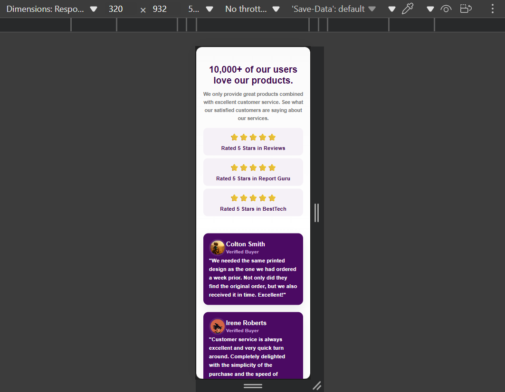
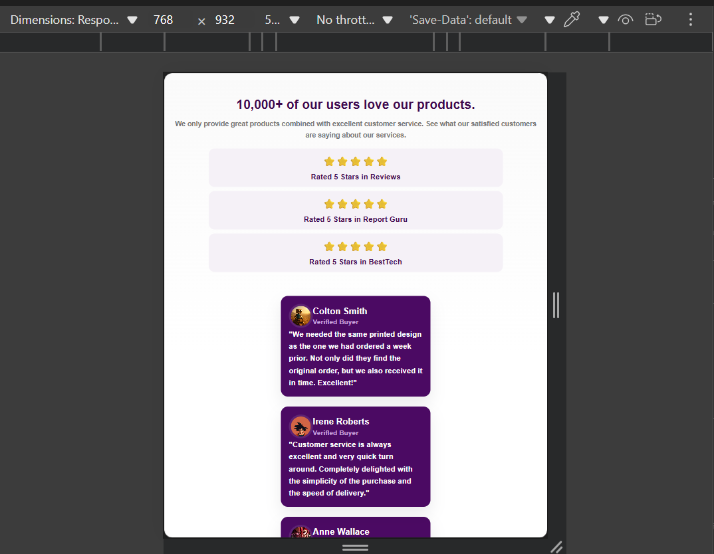
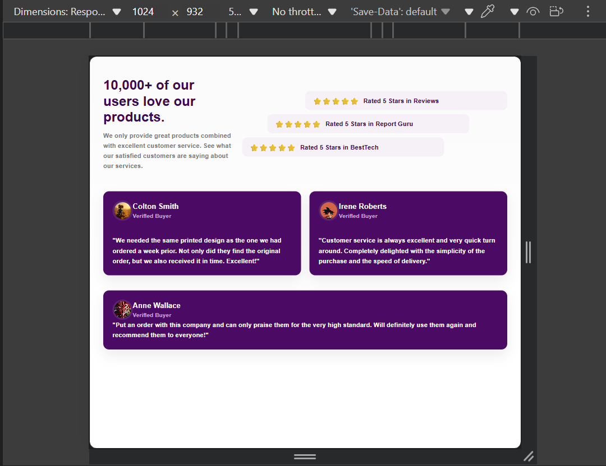

# PROJET - PAGE DE TEMOIGNAGES (SOCIAL PROOF)

## Description du Projet

Ce projet est une page web présentant des témoignages clients avec un système d'évaluation. La page est conçue pour mettre en valeur les avis positifs des utilisateurs avec un design moderne et responsive.

## Objectif du Code

Créer une page "Social Proof" qui :
- Affiche un titre principal avec des statistiques
- Présente des évaluations sous forme d'étoiles
- Montre des témoignages clients avec photos
- S'adapte aux mobiles et ordinateurs

## Structure HTML - Explication des Balises

### **Balises Principales**

```html
<!doctype html>
<html lang="fr">
```
- **`<!doctype html>`** : Déclare que c'est un document HTML5
- **`<html lang="fr">`** : Racine du document, en français

### **En-tête (Head)**
```html
<head>
  <meta charset="utf-8" />
  <meta name="viewport" content="width=device-width,initial-scale=1" />
  <title>Social Proof — Témoignages</title>
  <link rel="stylesheet" href="style2.css">
</head>
```
- **`<meta charset="utf-8">`** : Support des caractères français (accents)
- **`<meta name="viewport">`** : Rend la page responsive sur mobile
- **`<title>`** : Titre qui s'affiche dans l'onglet du navigateur
- **`<link>`** : Lie le fichier CSS pour le style

### **Corps (Body)**
```html
<body>
  <main class="conteneur-principal">
```
- **`<main>`** : Contenu principal de la page
- **`class="conteneur-principal"`** : Classe pour le style CSS

### **Section Haut - Titre + Évaluations**
```html
<section class="section-haut">
  <div class="bloc-titre">
    <h1><span class="chiffre">10,000+</span> of our users love our products.</h1>
    <p class="intro">We only provide great products...</p>
  </div>
```
- **`<section>`** : Section thématique
- **`<h1>`** : Titre principal (le plus important)
- **`<span>`** : Pour styler une partie du texte différemment
- **`<p>`** : Paragraphe d'introduction

### **Section Évaluations**
```html
<aside class="bloc-evaluations" aria-label="Évaluations">
  <div class="evaluation eval-1">
    <div class="etoiles">⭐⭐⭐⭐⭐</div>
    <div class="texte-eval">Rated 5 Stars in Reviews</div>
  </div>
</aside>
```
- **`<aside>`** : Contenu complémentaire (évaluations)
- **`aria-label`** : Aide les lecteurs d'écran à comprendre le contenu
- Les étoiles sont simplement des emojis ⭐

### **Section Témoignages**
```html
<section class="section-temoignages" aria-label="Témoignages clients">
  <article class="carte temoignage small">
    <header class="entete-carte">
      
      <div class="infos">
        <h3>Colton Smith</h3>
        <div class="statut">Verifled Buyer</div>
      </div>
    </header>
    <p class="texte">"We needed the same printed design..."</p>
  </article>
</section>
```
- **`<article>`** : Contenu autonome (chaque témoignage)
- **`<header>`** : En-tête de la carte témoignage
- **``** : Image avec attribut **`alt`** pour l'accessibilité
- **`<h3>`** : Titre de niveau 3 (nom de la personne)

## Style CSS - Points Essentiels

### **Variables CSS (Custom Properties)**
```css
:root {
  --violet-fonce: #4b0a63;
  --fond-page: #fafafa;
  --arrondi: 14px;
}
```
- **`:root`** : Définit des variables réutilisables dans tout le CSS
- **`--nom-variable`** : Permet de changer les couleurs facilement

### **Reset de Base**
```css
* {box-sizing: border-box; margin: 0; padding: 0;}
```
- **`box-sizing: border-box`** : Inclut padding et border dans la largeur/hauteur
- Supprime les marges et padding par défaut

### **Layout avec Grid et Flexbox**

#### **Section Haut (Desktop)**
```css
.section-haut {
  display: grid;
  grid-template-columns: 50% 50%;
}
```
- **`grid`** : Crée un layout en 2 colonnes égales

#### **Évaluations Décalées**
```css
.eval-1 { transform: translateX(-60px); }
.eval-2 { transform: translateX(-90px); }
.eval-3 { transform: translateX(-150px); }
```
- **`transform: translateX()`** : Décale les évaluations vers la gauche pour un effet visuel

#### **Section Témoignages**
```css
.section-temoignages {
  display: grid;
  grid-template-columns: repeat(2, 1fr);
}
.temoignage.large {
  grid-column: 1 / -1;
}
```
- **`grid-template-columns: repeat(2, 1fr)`** : 2 colonnes de taille égale
- **`grid-column: 1 / -1`** : La grande carte prend toute la largeur

### **Effets Visuels**
```css
.carte:hover {
  background: var(--violet-survol);
  transition: background 0.25s ease;
}
```
- **`:hover`** : Effet au survol de la souris
- **`transition`** : Animation fluide du changement de couleur

### **Responsive Mobile**
```css
@media (max-width: 768px) {
  .section-haut {
    grid-template-columns: 1fr;
  }
}
```
- **`@media`** : Applique des styles seulement sur écran ≤ 768px
- **`1fr`** : Une seule colonne sur mobile

---

## Points Clés à Retenir

### **Pour le HTML :**
- Utilise **`<section>`** et **`<article>`** pour structurer le contenu
- **`aria-label`** améliore l'accessibilité
- Les images doivent toujours avoir un **`alt`** descriptif

### **Pour le CSS :**
- Les **variables CSS** (`--nom`) facilitent les modifications
- **Grid** pour les layouts complexes, **Flexbox** pour l'alignement
- **Media queries** (`@media`) pour le responsive design
- **`transform`** pour les décalages et effets
- **`transition`** pour les animations fluides

### **Structure Responsive :**
- **Desktop** : 2 colonnes côte à côte
- **Mobile** : Tout s'empile verticalement
- Les évaluations passent de décalées à centrées

Cette page montre des témoignages clients avec évaluations. Le code utilise :
- **HTML sémantique** (`section`, `article`, `header`) pour une meilleure structure
- **CSS Grid** pour le layout principal
- **Variables CSS** pour une maintenance facile
- **Design responsive** qui s'adapte mobile/desktop

Les couleurs violettes dominent, avec des effets de survol et un décalage visuel des évaluations sur desktop.
# Lien du Git Page : https://2523razak.github.io/Projet_HTML_CSS/

## Aperçu du Projet Mobile S 320px



## Aperçu du Projet Tablette 768px



## Aperçu du Projet Laptop 1440px




