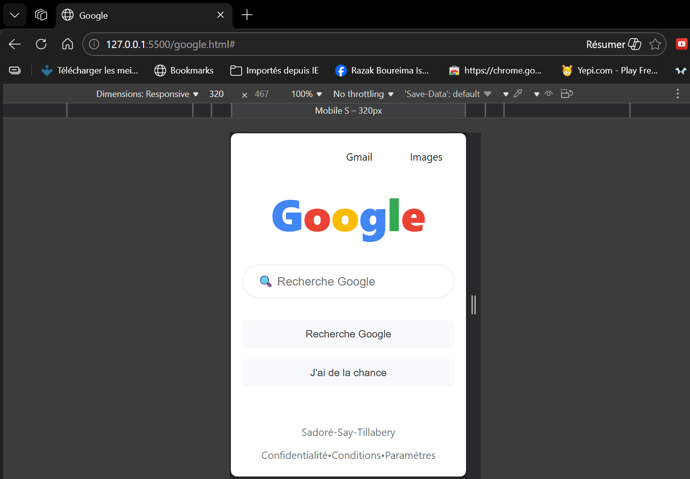
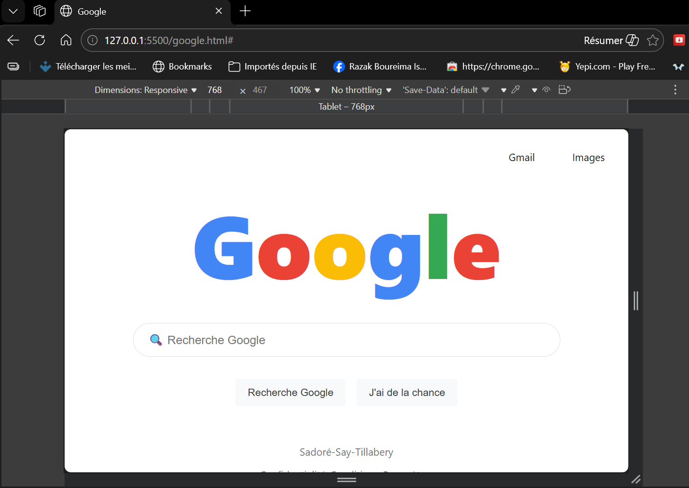
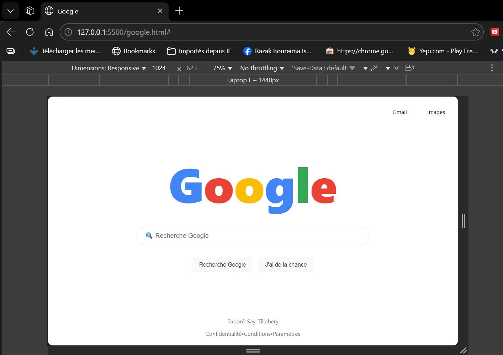

# Explication du Code - Page d'Accueil Google

## Structure HTML

### En-tête (Header)
```html
<header class="en-tete">
    <span class="lien-gmail"><a href="#">Gmail</a></span>
    <a href="#">Images</a>
</header>
```
- **`<header>`** : Contient la navigation en haut de page
- **Liens** : "Gmail" et "Images" alignés à droite
- **Effet hover** : Changement de fond au survol

### Contenu Principal (Main)
```html
<main class="contenu-principal">
    <!-- Logo Google coloré -->
    <section class="logo-google">
        <h1 class="bleu">G</h1>
        <h1 class="rouge">o</h1>
        <!-- ... autres lettres -->
    </section>
    
    <!-- Barre de recherche -->
    <section class="section-recherche">
        <div class="conteneur-recherche">
            <input type="text" class="champ-recherche" placeholder="🔍 Recherche Google">
        </div>
    </section>
    
    <!-- Boutons d'action -->
    <section class="section-boutons">
        <button class="bouton-recherche">Recherche Google</button>
        <button class="bouton-chance">J'ai de la chance</button>
    </section>
</main>
```

### Pied de Page (Footer)
```html
<footer class="liens-supplementaires">
    <div class="ligne-liens">
        <span>Sadoré-Say-Tillabery</span>
    </div>
    <div class="ligne-localisation">
        <span>Confidentialité•Conditions•Paramètres</span>
    </div>
</footer>
```

## Styles CSS

### Reset et Base
```css
* {
    margin: 0;
    padding: 0;
    box-sizing: border-box;
}
```
- **Reset** : Supprime les marges et paddings par défaut
- **Box-sizing** : Inclut bordures/paddings dans les dimensions

### Disposition Globale
```css
body {
    height: 100vh;
    display: flex;
    flex-direction: column;
}
```
- **Flexbox** : Organisation verticale header/main/footer
- **100vh** : Prend toute la hauteur de l'écran

### Logo Google Coloré
```css
.logo-google h1 {
    font-size: 90px;
    font-weight: normal;
}
.bleu { color: #4285F4; }
.rouge { color: #EA4335; }
.jaune { color: #FBBC05; }
.vert { color: #34A853; }
```
- **Chaque lettre** a sa propre classe de couleur
- **Taille** : 90px pour desktop

### Barre de Recherche
```css
.champ-recherche {
    width: 100%;
    height: 46px;
    border-radius: 24px;
    border: 1px solid #dfe1e5;
    padding: 0 45px;
}
.icone-recherche {
    position: absolute;
    left: 15px;
    top: 50%;
    transform: translateY(-50%);
}
```
- **Position absolute** : Icône positionnée dans la barre
- **Border-radius** : Coins arrondis style Google
- **Padding** : Espace pour l'icône

### Effets Interactifs
```css
/* Survol des liens header */
.en-tete a:hover {
    background-color: #f0f0f0;
    border-radius: 8px;
}

/* Survol barre de recherche */
.champ-recherche:hover {
    box-shadow: 0 1px 6px rgba(32,33,36,.28);
}

/* Survol boutons */
.bouton-recherche:hover {
    box-shadow: 0 1px 1px rgba(0,0,0,.1);
    border: 1px solid #dadce0;
    background-color:  #34A853;
}
```

### Responsive Design
```css
@media (max-width: 760px) {
    .logo-google h1 { font-size: 60px; }
    .section-recherche { width: 90%; }
    .section-boutons { 
        flex-direction: column;
        width: 90%;
    }
    .bouton-recherche { width: 100%; }
}
```
- **Media query** : Adapte le style pour mobile
- **Flex-direction column** : Boutons empilés verticalement
- **Width 90%** : Prend presque toute la largeur

## Fonctionnement

1. **Structure** : Header → Main → Footer (flex column)
2. **Centrage** : Le main prend tout l'espace disponible avec `flex-grow: 1`
3. **Responsive** : Le media query s'active en dessous de 760px
4. **Interactions** : Effets visuels au survol pour meilleure UX

Le code reproduit fidèlement l'interface Google avec une structure simple et un CSS efficace.


## Aperçu du Projet Mobile S 320px



## Aperçu du Projet Tablette 768px



## Aperçu du Projet Laptop 1440px




