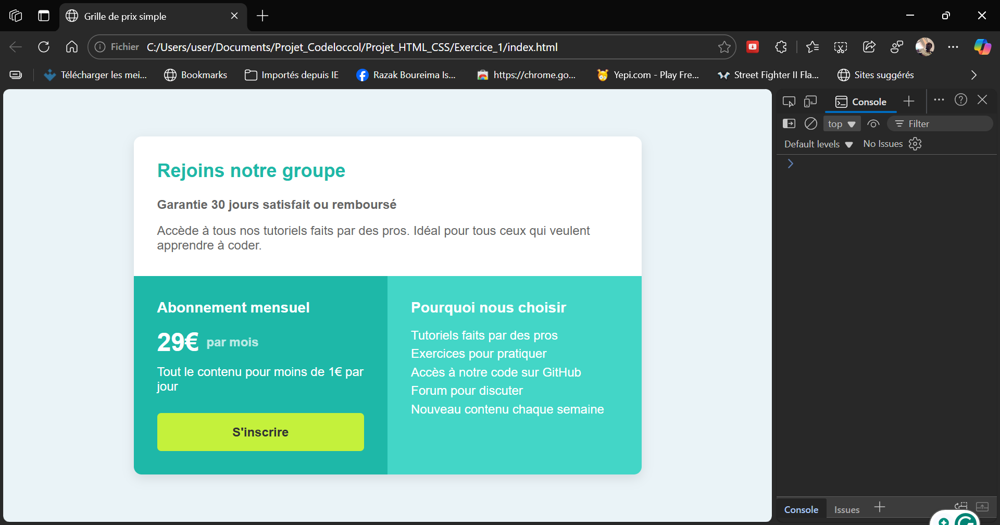
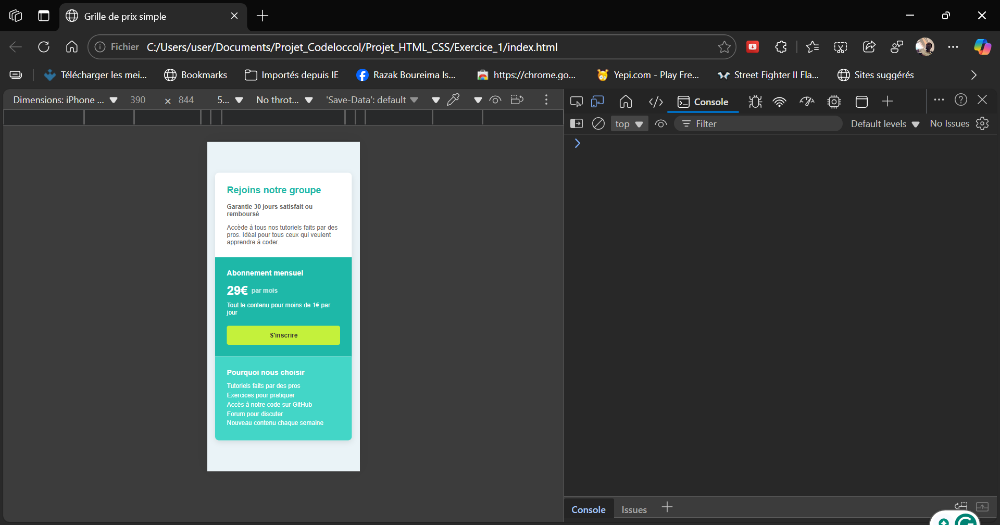

# Information sur les projets :

## - Projet 1 → se trouve sur la branche principale
## - Projet 2 (Page de témoignages / Preuve sociale) → se trouve sur la ` branche projet-2`
## - Projet 3 (GOOGLE) → se trouve sur la ` branche projet-3`

# README – Grille de prix simple en HTML & CSS

## Description du projet

Ce projet est une **page web simple** qui présente une grille de prix pour un service ou un abonnement.
L’objectif est pédagogique : aider les débutants à comprendre comment organiser une page avec **HTML** et la styliser avec **CSS**, tout en créant une mise en page responsive (qui s’adapte aux ordinateurs et aux téléphones).

Le projet contient deux fichiers principaux :

* `index.html` → Contient le contenu de la page.
* `style.css` → Contient le style et l’apparence de la page.

## 1. Structure du code HTML

### Déclaration du document

```html
<!DOCTYPE html>
<html lang="fr">
```

* `<!DOCTYPE html>` : Indique que le fichier est un document **HTML5**.
* `<html lang="fr">` : Débute le code HTML et définit la langue en français pour le navigateur.

### En-tête du document (`<head>`)

```html
<head>
    <meta charset="UTF-8">
    <meta name="viewport" content="width=device-width, initial-scale=1.0">
    <title>Grille de prix simple</title>
    <link rel="stylesheet" href="style.css">
</head>
```

* `<meta charset="UTF-8">` : Permet d’afficher correctement les caractères accentués.
* `<meta name="viewport"...>` : Rend la page responsive (s’adapte aux écrans mobiles).
* `<title>` : Le titre qui apparaît dans l’onglet du navigateur.
* `<link rel="stylesheet" href="style.css">` : Lien vers le fichier CSS pour styliser la page.

### Corps de la page (`<body>`)

```html
<body>
    <div class="boite-principale">
        ...
    </div>
</body>
```

* `<body>` : Contient tout ce qui sera affiché à l’écran.
* `<div class="boite-principale">` : Conteneur principal regroupant **tous les éléments de la page**.

### En-tête visible sur la page

```html
<section class="entete">
    <h2>Join our community</h2>
    <p class="garantie">30-days, hassle-free money back guarantee</p>
    <p>Gain access to our full library of tutorials along with expert code reviews...</p>
</section>
```

* `<section>` : Sert à regrouper un contenu logique.
* `<h2>` : Titre de l’en-tête.
* `<p>` : Paragraphe pour les textes descriptifs.
* `.garantie` : Classe CSS pour styliser spécifiquement ce texte.

### Section des prix et avantages

```html
<div class="section-prix">
    <section class="abonnement"> ... </section>
    <section class="avantages"> ... </section>
</div>
```

* `<div class="section-prix">` : Conteneur pour les deux blocs principaux.
* `<section class="abonnement">` : Bloc affichant le prix et bouton d’inscription.
* `<section class="avantages">` : Bloc listant les bénéfices pour l’utilisateur.

#### Bloc abonnement

```html
<h3>Monthly Subscription</h3>
<div class="prix">
    <span>$29</span>
    <span class="par-mois">per month</span>
</div>
<p>Full access for less than $1 a day</p>
<a href="#" class="bouton">Sign Up</a>
```

* `<h3>` : Sous-titre pour le type d’abonnement.
* `<div class="prix">` : Contient le prix et la fréquence.
* `<span>` : Sert à styliser séparément le prix et le texte "par month".
* `<a href="#" class="bouton">` : Lien qui sert de bouton pour s’inscrire.

#### Bloc avantages

```html
<h3>Why Us</h3>
<ul>
    <li>Tutorials by industry experts</li>
    <li>Peer & expert code review</li>
    <li>Coding exercises</li>
    ...
</ul>
```

* `<ul>` : Liste à puces.
* `<li>` : Chaque élément de la liste.

## 2. Explication du CSS

### Réinitialisation des marges et paddings

```css
* {
    margin: 0;
    padding: 0;
    box-sizing: border-box;
}
```

* Supprime les marges et paddings par défaut pour tous les éléments.
* `box-sizing: border-box` : Facilite le calcul des tailles (padding inclus).

### Styles du corps et du fond

```css
body {
    font-family: Arial, sans-serif;
    background-color: #eaf3f7;
    color: #333;
    min-height: 100vh;
    display: flex;
    justify-content: center;
    align-items: center;
    padding: 20px;
}
```

* Définit la police, les couleurs, et centre la page au milieu de l’écran.

### Boîte principale

```css
.boite-principale {
    max-width: 650px;
    width: 100%;
    border-radius: 10px;
    overflow: hidden;
    box-shadow: 0 5px 15px rgba(0,0,0,0.1);
}
```

* Crée un conteneur avec des **coins arrondis**, une **ombre légère** et une largeur maximale.

### En-tête

```css
.entete {
    background-color: #fff;
    padding: 30px;
}
.entete h2 { color: #040404; margin-bottom: 20px; font-size: 1.5rem; }
.entete p { color: #dad7d793; font-size: 16px; }
.entete p.garantie { color:hsl(71, 73%, 54%); font-weight: bold; margin-bottom: 15px; }
```

* Styles pour le texte de l’en-tête et le texte de garantie.

### Section prix et avantages

```css
.section-prix { display: flex; flex-wrap: wrap; }
.abonnement, .avantages { flex: 1; min-width: 300px; padding: 30px; }
```

* Utilise **Flexbox** pour afficher les deux blocs côte à côte.
* `flex-wrap: wrap` : Si l’écran est trop petit, les blocs passent en colonne.

### Bloc abonnement

```css
.abonnement { background-color: #1eb8a8; color: #fff; }
.prix { font-size: 2rem; font-weight: bold; display: flex; align-items: center; }
.bouton { background-color: #c4f13b; text-align: center; padding: 15px; border-radius: 5px; transition: 0.3s; }
.bouton:hover { background-color: #b3df2f; }
```

* Stylise le **prix**, le **bouton d’inscription**, et ajoute un **effet au survol**.

### Bloc avantages

```css
.avantages { background-color: #43d6c7; color: #fff; }
.avantages ul { list-style-type: none; }
.avantages li { margin-bottom: 5px; font-size: 16px; }
```

* Stylise la liste des avantages sans puces et avec une couleur de fond différente.

### Responsive pour mobile

```css
@media (max-width: 768px) {
    .section-prix { flex-direction: column; }
}
```

* Sur les écrans petits, les deux blocs se placent **verticalement** pour mieux s’afficher.



